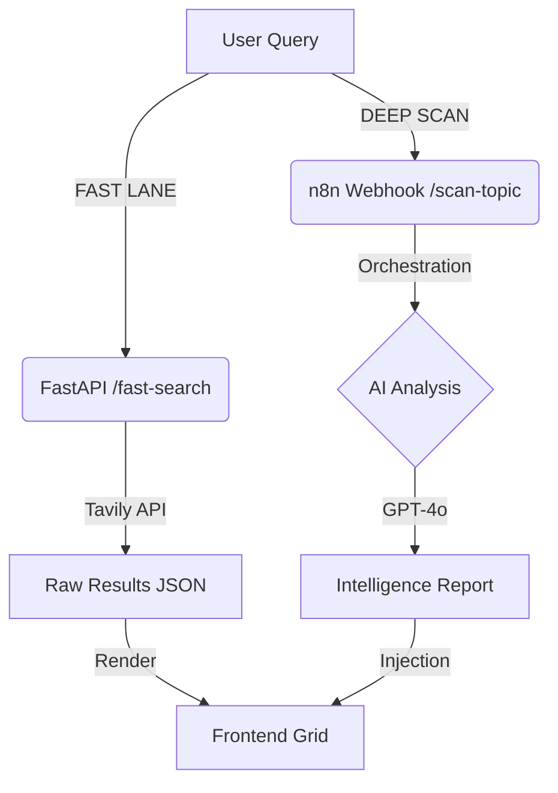

# ARCHITECTURE // SGNL

## 1. LOGIC FLOW: DUAL-ENGINE
The system splits user intent into two distinct pipelines to minimize Time-to-First-Byte (TTFB) while maximizing Information Density.



## 2. COMPONENT STACK

### Backend (Python/FastAPI)
- **Role:** Gatekeeper & Aggregator.
- **Middleware:** Custom `RateLimitMiddleware` (Token Bucket algorithm).
- **Validation:** Pydantic models strict typing for all ingress/egress.

### Frontend (Vanilla JS + GSAP)
- **Framework:** None. Pure DOM manipulation.
- **State:** Minimal reactive logic in `main.js`.
- **Animation:** GSAP for precise, non-blocking UI injections (Intelligence Report slide-down).

### Intelligence Layer (LLM)
- **Model:** GPT-4o / DeepInfra.
- **Prompt Engineering:**
  - Role: "Military Intelligence Analyst"
  - Constraints: "No preamble. No fluff. Bullet points only."
  - Metric: "Signal Score (0-100)" based on factual density.

## 3. SECURITY & PERFORMANCE

### Rate Limiting
- **Policy:** IP-based.
- **Limit:** 3 requests per 60 seconds.
- **Response:** HTTP 429 + `Retry-After` header.

### Error Handling
- **No Signal:** Custom UI state for empty result sets.
- **System Overload:** CSS-animated "Cooldown" timer for rate limits.

## 4. DIRECTORY STRUCTURE
```
/app
├── main.py            # Entry point & Middleware
├── extractor.py       # (Legacy) Text extraction logic
├── models.py          # Pydantic Schemas
├── templates/         # Jinja2 HTML
└── static/
    ├── css/           # Brutalist Design System
    └── js/            # Async Logic
```
